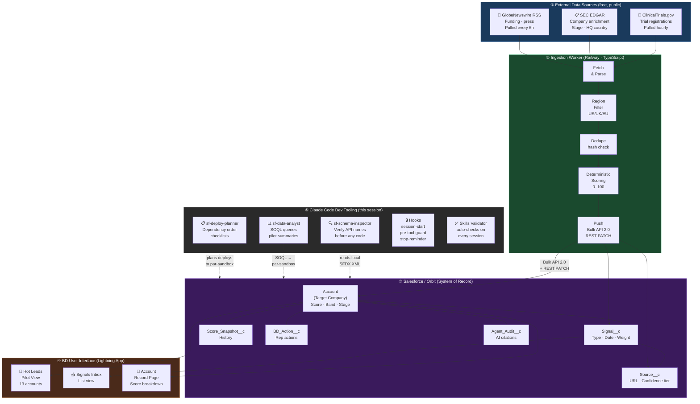

# Astrum Phase I Lead Agent — Solution Layers



## Layer summary

| # | Layer | Technology | Purpose |
|---|---|---|---|
| ① | External Sources | ClinicalTrials.gov, EDGAR, GlobeNewswire | Raw signal data — free, public, no scraping |
| ② | Ingestion Worker | TypeScript / Node on Railway | Fetch, filter, dedupe, score, push |
| ③ | Salesforce / Orbit | 6 custom objects on PAR sandbox | System of record — companies, signals, scores, BD actions |
| ④ | BD User Interface | Lightning App + list views | Catherine and team review leads, log BD actions |
| ⑤ | Claude Code Tooling | Sub-agents, hooks, validator | Developer guard-rails and AI assistance for building on ③ |

## Data flow in one sentence
> Public trial and funding data is pulled hourly, scored deterministically, written to Salesforce, and surfaced to BD reps as a ranked list of Phase I prospects.
```
